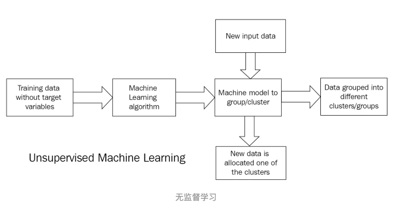
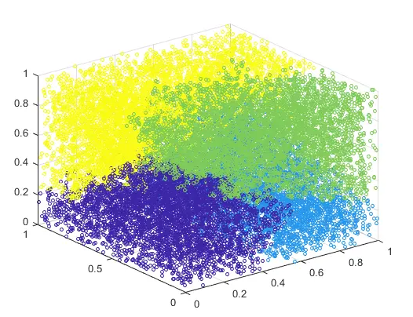
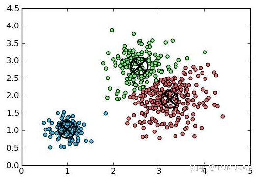
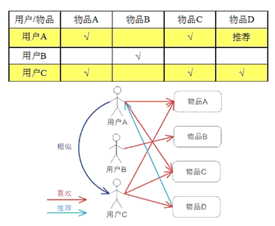
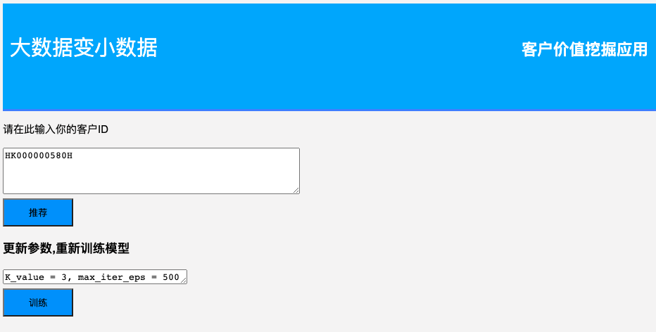
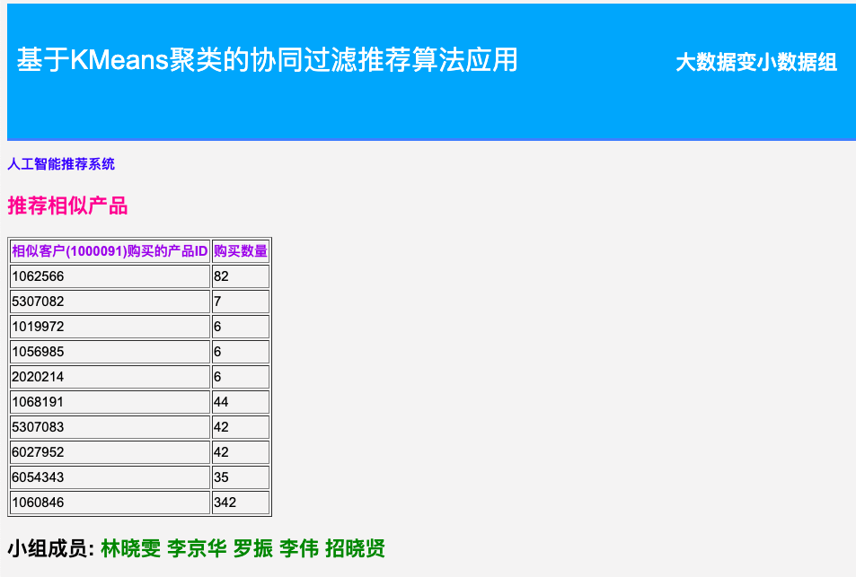
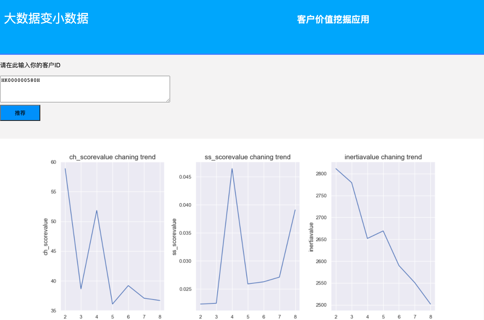

# 基于KMeans聚类的协同过滤推荐算法应用
## 算法原理
### 1. 无监督学习



### 2. 无监督学习--聚类分析
聚类学习将数据集中的样本分成若干个互不相交的子集（称为簇cluster）。
保持簇内差异尽可能小而簇间差异尽可能大我们就可以将每个簇映射到一些潜在的类别。





### 3. 协同过滤
1.收集用户信息
收集可以代表用户的兴趣信息。一般的网站系统使用评分的方式或是给予评价，这种方式被称为“主动评分”。另外一种是“被动评分”，是根据用户的行为模式由系统代替用户完成评价，不需要用户直接打分或输入评价数据。
2.最近邻搜索(Nearest neighbor search, NNS)
以用户为基础（User-based）的协同过滤的出发点是与用户兴趣爱好相同的另一组用户，就是计算两个用户的相似度。例如：查找n个和A有相似兴趣用户，把他们对M的评分作为A对M的评分预测。一般会根据数据的不同选择不同的算法，较多使用的相似度算法有Pearson Correlation Coefficient、Cosine-based Similarity、Adjusted Cosine Similarity。
3.产生推荐结果
有了最近邻集合，就可以对目标用户的兴趣进行预测，产生推荐结果。依据推荐目的的不同进行不同形式的推荐，较常见的推荐结果有Top-N 推荐和关系推荐。Top-N 推荐是针对个体用户产生，对每个人产生不一样的结果，例如：通过对A用户的最近邻用户进行统计，选择出现频率高且在A用户的评分项目中不存在的，作为推荐结果。关系推荐是对最近邻用户的记录进行关系规则(association rules)挖掘。

总结:
基于用户的 CF 的基本思想是基于用户对物品的偏好找到相邻邻居用户，然后将邻居用户喜欢的推荐给当前用户。
计算上，就是将一个用户对所有物品的偏好作为一个向量来计算用户之间的相似度，
找到 K 邻居后，根据邻居的相似度权重以及他们对物品的偏好，预测当前用户没有偏好的未涉及物品，计算得到一个排序的物品列表作为推荐。
给出了一个例子，对于用户 A，根据用户的历史偏好，这里只计算得到一个邻居 – 用户 C，然后将用户 C 喜欢的物品 D 推荐给用户 A。



### 项目运行 环境准备: package two ways: 
#### 1. 一个一个装
```linux
pip install pandas -i https://pypi.douban.com/simple --user
pip install pandas -i https://pypi.douban.com/simple --user
pip install pip install matplotlib -i https://pypi.douban.com/simple --user
pip install flask -i https://pypi.douban.com/simple --user
pip install seaborn -i https://pypi.douban.com/simple --user
pip install sklearn -i https://pypi.douban.com/simple --user
pip install xlrd -i https://pypi.douban.com/simple --user
```

#### 2. 用requirements来装
pip install -r requirements.txt


## 项目运行 (方法一)
step1: 在目录终端下,输入命令,启动后
```linux
python app.py
```
step2: 点击http://127.0.0.1:5050/ , 就可以去到交互页面,输入客户id,例如(HK000000580H),就可以得到推荐产品
同时也可以再下方先输入权重参数,对模型进行训练,训练后,可以参考指标,然后再去推荐产品







## 项目运行(方法二)
1. 修改Utilities文件下的parameters.py中的参数
2. 在model_trainning.py文件上点击run即可


## reference: 
### ref1: 参数的调整,如聚类数目,文件路径,模型迭代轮次
请到Utlities文件下的parameters.py文件,你将会看到以下参数
```
sales_data_path = 'data/output/2019.xlsx' #销售数据excel格式
plt_save_path = 'data/opic' 参考K值最好数目图
K_value = 3  聚类数目设置
max_iter_eps = 500 迭代轮次
```
### ref2: 目录介绍
1. data目录存放数据
2. img存放图片
3. static和template是网站页面设计
4. Uilities是工具目录
5. app.py 是项目执行文件
6. backup是备份目录
7. main.py.ipynb是实验测试文档
8. readme是整个项目介绍

### 3. 参考文献
[python聚类分析实现电商用户细分（基于RFM用户价值分析模型）](https://blog.csdn.net/dhr223/article/details/105568355?utm_medium=distribute.pc_aggpage_search_result.none-task-blog-2~all~sobaiduend~default-3-105568355.nonecase&utm_term=python%E8%81%9A%E7%B1%BB%E5%88%86%E6%9E%90%E5%AE%9E%E7%8E%B0%E7%94%B5%E5%95%86%E7%94%A8%E6%88%B7%E7%BB%86%E5%88%86%E6%BA%90%E4%BB%A3%E7%A0%81&spm=1000.2123.3001.4430)


